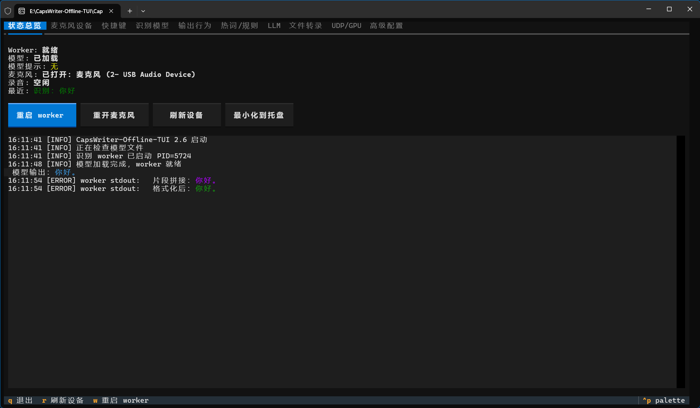
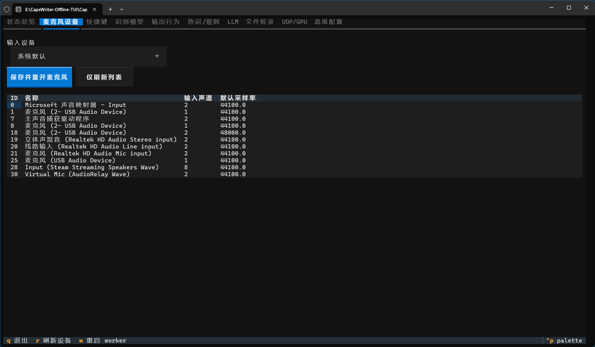
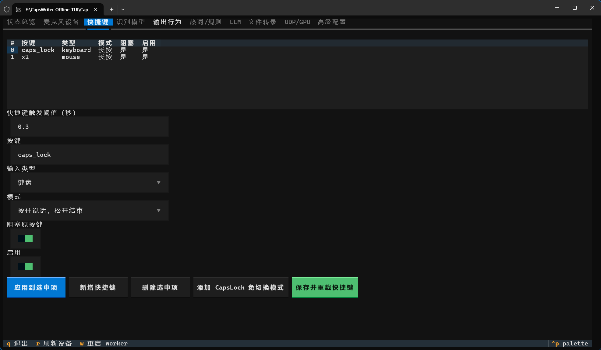
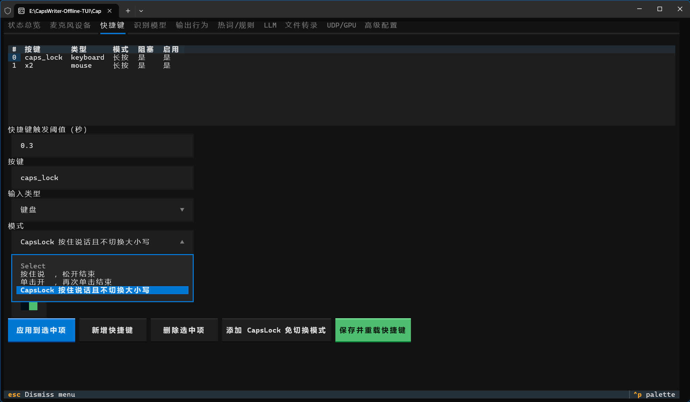

# CapsWriter-Offline-TUI

在 [CapsWriter-Offline](https://github.com/HaujetZhao/CapsWriter-Offline) 基础上添加 TUI 可视化配置界面及部分实用功能，方便新手小白上手。

## ✨ 主要变更

- 取消服务端和客户端分离架构，改为单程序结构，双击 exe 即可运行
- 添加便于操作的可视化 TUI 界面，可直接进行配置编辑、重启内核等
- 允许在配置页面中手动选择麦克风
- 麦克风插拔/变更时不再直接报错并退出，而是允许重新打开或切换
- 模型选择界面添加下载模型引导
- 允许配置响应任意按键（默认大写锁定键 + 鼠标侧键）
- 新增 `CapsLock 按住说话且不切换大小写` 选项并设为默认，防止误操作切换大小写状态

## 🎬 快速开始

1.  **准备环境**：确保安装了 [VC++ 运行库](https://learn.microsoft.com/zh-cn/cpp/windows/latest-supported-vc-redist)。若要使用文件转录功能，还需安装 [ffmpeg](https://ffmpeg.org/download.html) 并确保其在系统 PATH 中。
2.  **下载解压**：下载 [Latest Release](https://github.com/Mooshed88-a/CapsWriter-Offline-TUI/releases/latest) 里的软件本体，再到 [Models Release](https://github.com/HaujetZhao/CapsWriter-Offline/releases/tag/models) 下载模型压缩包，将模型解压，放入 `models` 文件夹中对应模型的文件夹里。
3.  **启动程序**：双击 `CapsWriter-Offline-TUI.exe` 。
4.  **开始录音**：按住 `CapsLock键` 或 `鼠标侧键X2` 就可以说话了！

## 📖 使用说明

以下为本分支新增功能的相关说明：

### 麦克风设置

可在此处设置要使用的麦克风设备，如使用中途插拔麦克风，程序不会报错退出，而是在重新插入时自动识别。如果出现麦克风未识别状态，也可以手动点击“重开麦克风”按钮。

### 快捷键设置

可在此处配置要响应的快捷键，默认大写锁定键 + 鼠标侧键。

- `按住说，松开结束`：长按说话，短按切换大小写。
- `单击开，再次单击结束`：短按开始说话，再次短按结束。
- `CapLocks 按住说话且不切换大小写` （新增）：长按说话，短按也不切换大小写。如果已经开启大写锁定，会自动关闭，防止误操作打开大写锁定。

### 其他配置

请查看原项目说明，以了解其他配置的相关解释。

## ❤️ 致谢

- 本项目基于 [CapsWriter-Offline](https://github.com/HaujetZhao/CapsWriter-Offline) 二次开发，非常感谢 [HaujetZhao](https://github.com/HaujetZhao) 及其他维护者创造了如此优秀的一个项目。

# 原项目说明

以下为原项目 README (部分内容由于分支变更已失效，请以上方为准)

[点击前往](readme%20-%20old.md)